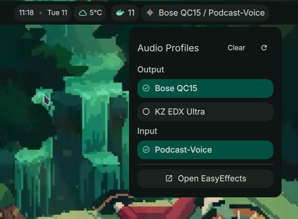

# EasyEffects Profile Switcher

A Dank Material Shell plugin for quickly switching between EasyEffects profiles.



## Features

- Shows currently active output and input profiles
- Click to open a menu with separate output and input profile sections
- Automatically detects and displays the currently active profiles
- Reload the profile list when you add new profiles
- Reset all presets to default state

## Requirements

- EasyEffects installed on your system
- Audio profiles configured in EasyEffects (output and/or input presets)

## Installation

1. Copy this plugin folder to your DMS plugins directory:

   ```bash
   mkdir -p ~/.config/DankMaterialShell/plugins/EasyEffects
   ```

2. The plugin will be automatically detected and can be enabled in DMS settings.

3. Configure your audio profiles in EasyEffects - the plugin will automatically detect them.

## Usage

- Click the bar widget to open the profile menu
- Select profiles from Output or Input sections
- Click "Clear" (top right) to reset all presets
- Click refresh icon (top right) to reload profiles
- Click "Open EasyEffects" to launch the full application

## Configuration

The plugin automatically detects both output and input presets from EasyEffects. Simply configure your presets in EasyEffects and they will appear in the plugin menu under their respective sections.

To add or modify presets:

1. Open EasyEffects and create/save your audio profiles
2. Click the refresh button in the plugin popout to reload the list

## Permissions

- `settings_read`: Read saved profile selection
- `settings_write`: Save current profile selection

## Version

1.0.0
