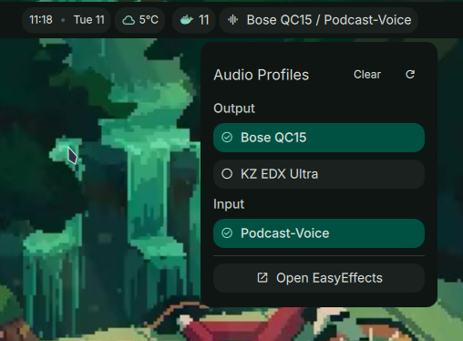

# Easy Effects Profile Switcher

A Dank Material Shell plugin for quickly switching between Easy Effects profiles.



## Features

- Shows currently active output and input profiles
- Click to open a menu with separate output and input profile sections
- Automatically detects and displays the currently active profiles
- Global bypass toggle to turn all effects on/off
- Reload the profile list when you add new profiles

The plugin only reads Easy Effects' state and never launches a windowed
instance. Starting Easy Effects is left to your normal setup (e.g. the
`easyeffects.service` systemd user service running `easyeffects --service-mode`).
If Easy Effects isn't running, the menu offers a button to start the service.

## Requirements

- Easy Effects installed on your system
- Audio profiles configured in Easy Effects (output and/or input presets)

### Recommended: start Easy Effects headless at login

Run Easy Effects as a background service so it's available without a window.
Easy Effects can install a systemd user service for this (its "Launch Service
at Login" preference). To make sure it never shows a window at login, add
`--hide-window` to the service's `ExecStart`:

```ini
# ~/.config/systemd/user/easyeffects.service
ExecStart=/usr/bin/easyeffects --service-mode --hide-window
```

Then `systemctl --user daemon-reload && systemctl --user restart easyeffects.service`.

## Installation

1. Copy the plugin folder into your DMS plugins directory:

   ```bash
   cp -r . ~/.config/DankMaterialShell/plugins/easyEffects
   ```

2. Reload DankMaterialShell; the plugin will be detected and can be enabled in
   DMS settings.

3. Configure your audio profiles in Easy Effects

## Usage

- Click the bar widget to open the profile menu
- Select profiles from output or input sections
- Click the power icon (top right) to toggle global bypass (effects on/off)
- Click refresh icon (top right) to reload profiles
- Click "Open Easy Effects" to launch the full application

## Configuration

Not much to it. The plugin should automatically detect both output and input presets.

## Permissions

- `settings_read`: Read saved profile selection
- `settings_write`: Save current profile selection

## Version

1.1.0
